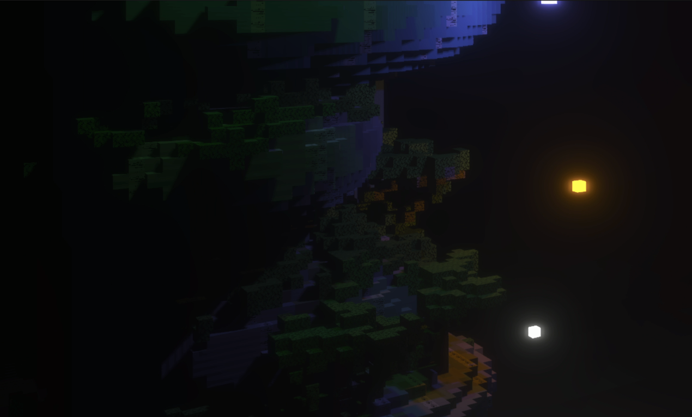
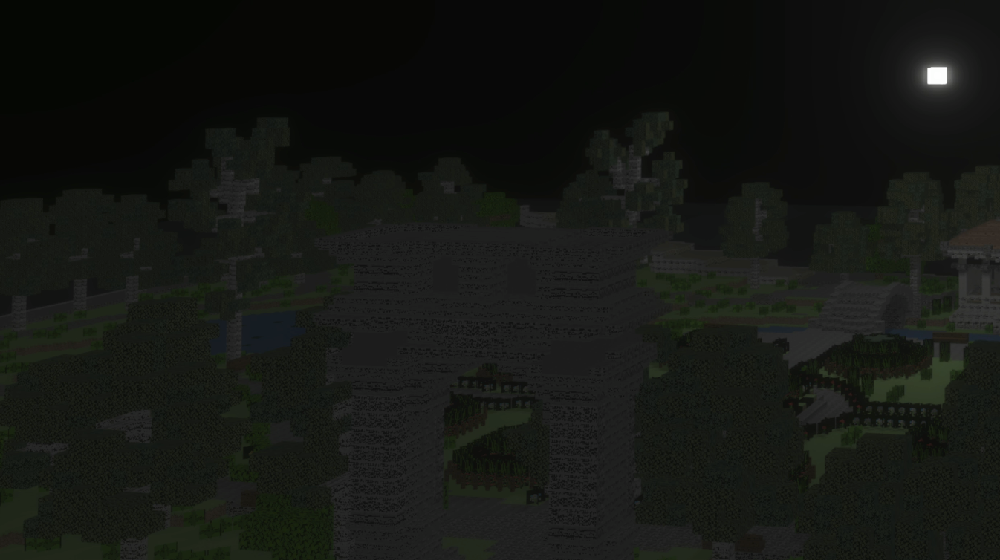
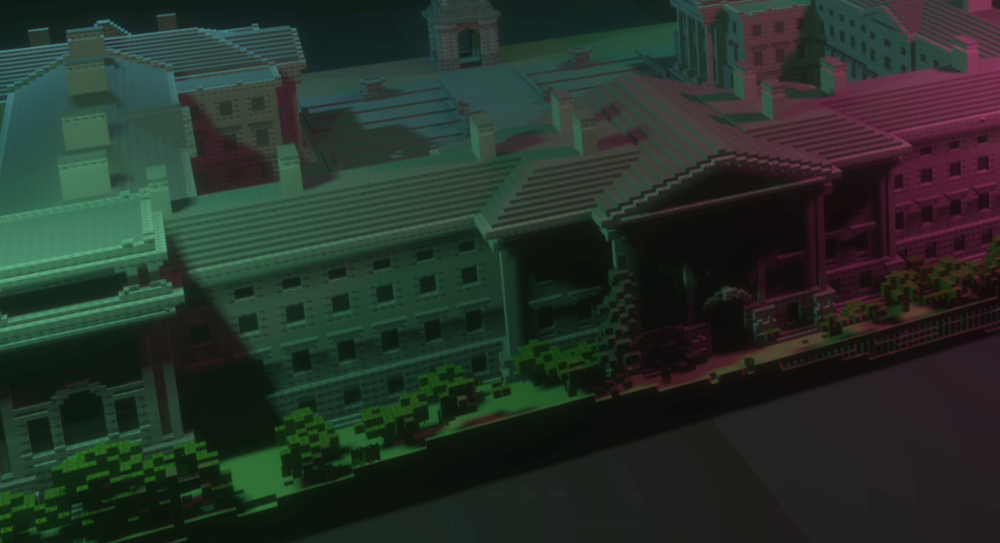

# Todhchai - Towards a Futuristic Emerald Isle

> This project was made for CSU44097: Computer Graphics under the teaching of Dr. Binh-Son Hua at Trinity College Dublin.

Todhchai (Irish for "Future") is an OpenGL rendering project envisioning a futuristic Dublin, illuminated by artificial floating suns and advanced lighting techniques. This project explores high-dynamic range (HDR) lighting, bloom effects, and dynamic point shadows to create an immersive nighttime cityscape.

## Scenes

| Scene  | Preview | Description |
|--------|---------|-----------------------------------------------------------|
| Scene 1 |  | A futuristic green skyscraper with multiple light sources |
| Scene 2 |  | A park with a single light source                         |
| Scene 3 |  | Trinity College Dublin with multiple vibrant lights       |

See the project in motion with the full demo video [here](docs/demo.mp4).

## About the Project

Todhchai is built on OpenGL and explores advanced rendering techniques. The project divides the cityscape into distinct sections to balance visual fidelity with performance constraints. A night-time setting was chosen to highlight the interplay of light and shadow, emphasizing real-time rendering techniques such as HDR and Bloom.

To achieve realistic lighting, the project employs a multi-pass rendering pipeline:

- **Shadow Mapping:** Generates depth maps to simulate realistic lighting and shadows.
- **HDR Framebuffer:** Captures high dynamic range lighting for better exposure handling.
- **Bloom Effect:** Extracts bright areas, applies Gaussian blur, and blends with the original scene.
- **Tone Mapping & Gamma Correction:** Ensures proper brightness and color balance.

Performance optimizations were necessary due to computational constraints. To maintain frame rates above 15 FPS, the city was split into multiple scenes, each demonstrating a different aspect of futuristic Dublin.

## Features

- **Physically Based Bloom** for realistic lighting effects
- **Dynamic Point Shadows** for moving light sources
- **HDR Rendering** for high-quality visuals
- **Interactive Controls:**
  - `WASD` + Mouse: Navigation
  - `UP/DOWN`: Adjust ambient light
  - `1-4`: Toggle different scenes
  - `P`: Toggle shadows
